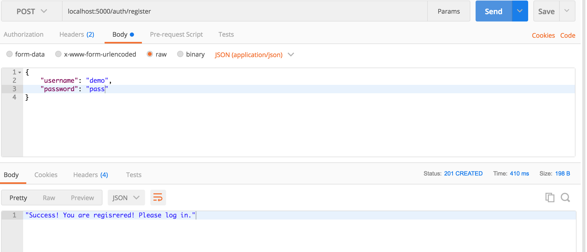
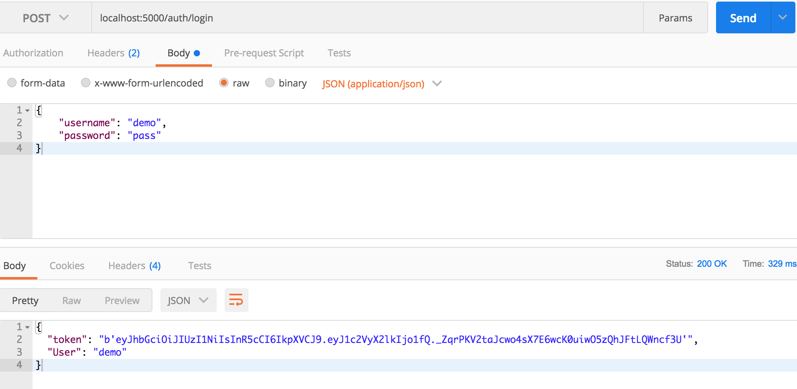
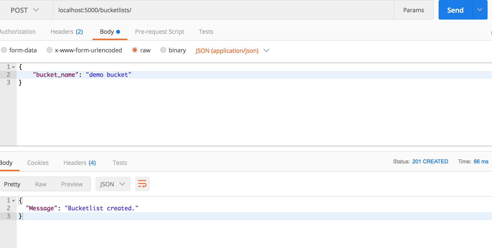
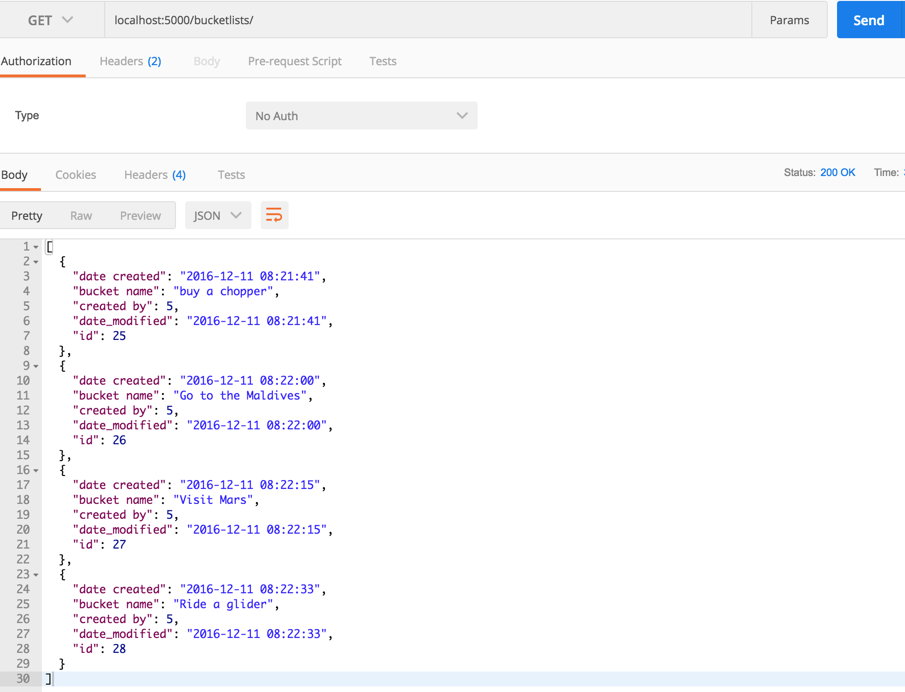
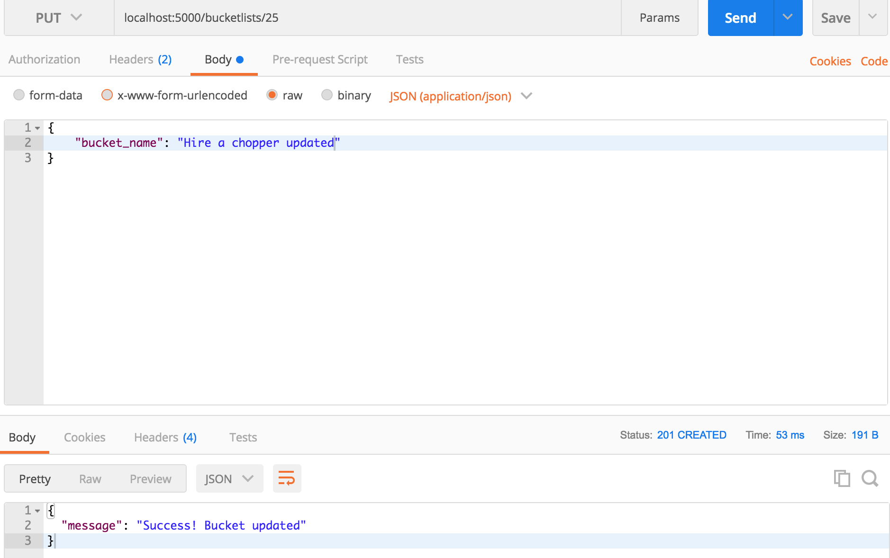
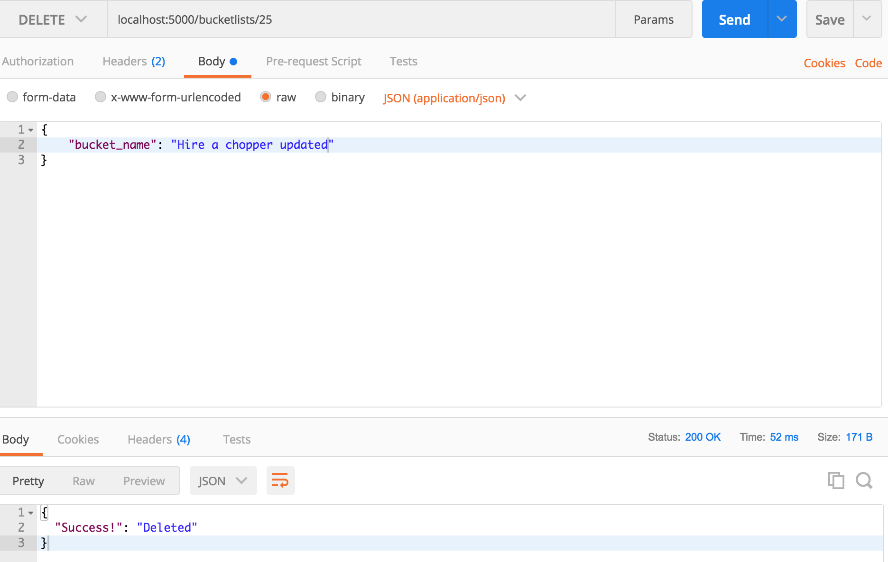
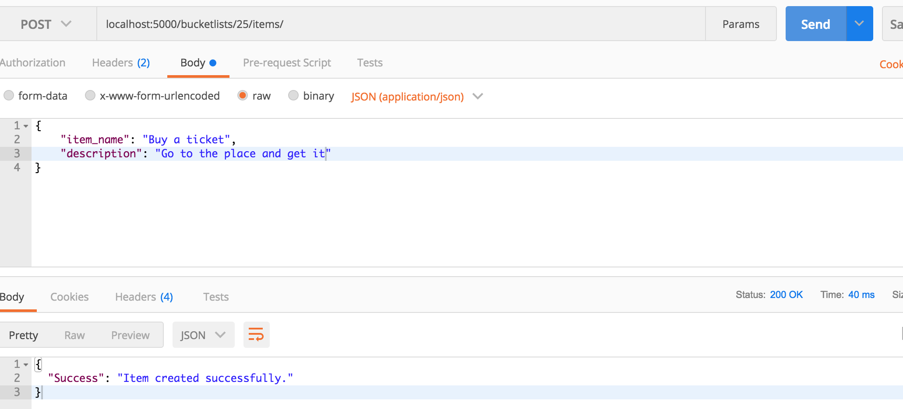
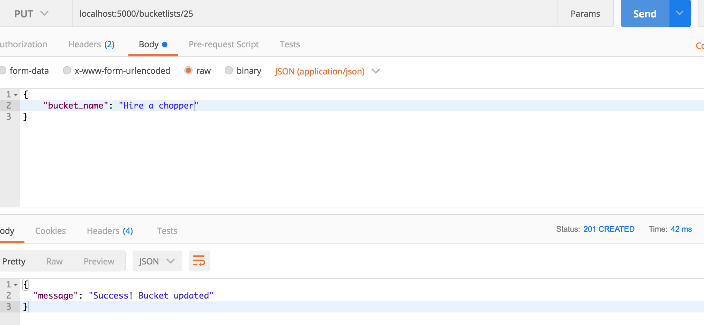
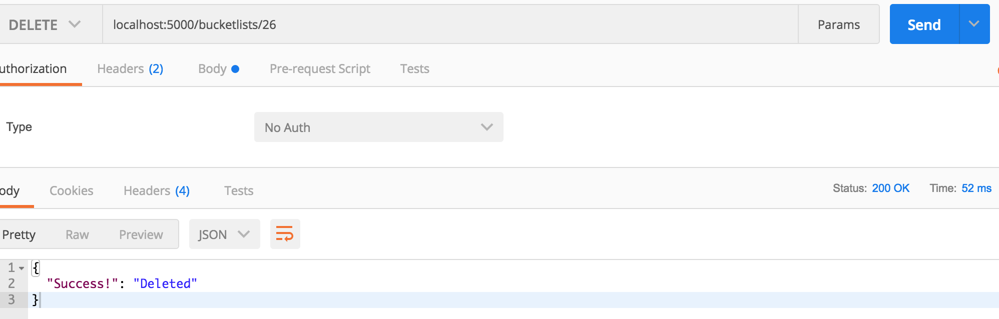

[](https://codeclimate.com/github/andela-ekaranja/cp2)

[](https://raw.githubusercontent.com/hyperium/hyper/master/LICENSE)
[](https://travis-ci.org/andela-ekaranja/cp2)
# CP2 BucketList API
### Intro:
This is a RESTful API written using Python's Flask microframework. Its features include CRUD operations for both bucketlists and bucketlist items.  

### Requirements:
- Python 3.5 and above
- Mac OSX 9 and above or any other UNIX/ LINUX system. It may not work in Windows systems.
- MySQL or MariaDB database.
### Setup.
- install Python on your system.
- Install virtualenv and vierualenvwrappers and set them up for your OS.
- Create a vierualenv for the project. `mkvirtualenv mybucket`
- Clone the api: `git clone https://..`
- Activate the virtualenv and install the requirements:
- - `worokon mybucket`
- - `pip install -r requirements.txt`
- Set up the database.
- - `python manage.py db init`
- - `python manage.py db migrate`
- - `python manage.py db upgrade`

### Usage
- To start the api, run `python manage.py runserver`

METHOD | ENDPOINT | FUNCTIONALITY
--- | --- | ---
POST| ```/auth/login``` | Logs a user in
POST | ```/auth/register``` | Register a user
POST| ```/bucketlists```| Create a new bucket list
GET| ```/bucketlists``` | List all the created bucket lists
GET|  ```/bucketlists/<id>```| Get single bucket list
PUT| ```/bucketlists/<id>```| Update this bucket list
DELETE | ```/bucketlists/<id>```| Delete this single bucket list
POST| ```/bucketlists/<id>/items/```| Create a new item in bucket list
PUT |```/bucketlists/<id>/items/<item_id>```|Update item in bucket list
DELETE |```/bucketlists/<id>/items/<item_id>```| Delete item in bucket list

### Screenshots

_User registration_


_User login_


_New bucketlist creation_


_Get all bucketlists_


_Update a bucketlist_


_Deleting a bucketlist_


_Creating a bucketlist item_


_Updating a bucketlist item_


_Deleting a bucketlist item_
### Misc
- To run tests using nose, run `nosetests`
- Released under the MIT lisence. Feel free to contribute or use as you please.
